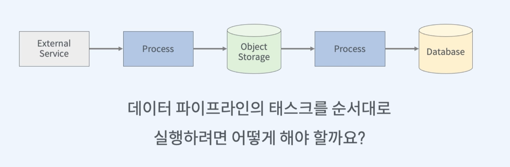
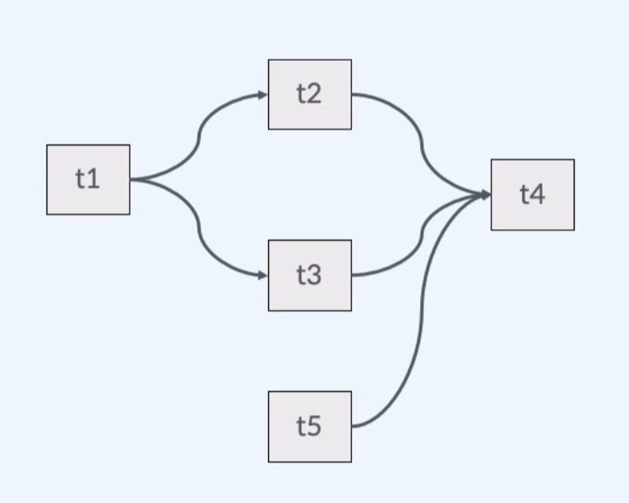
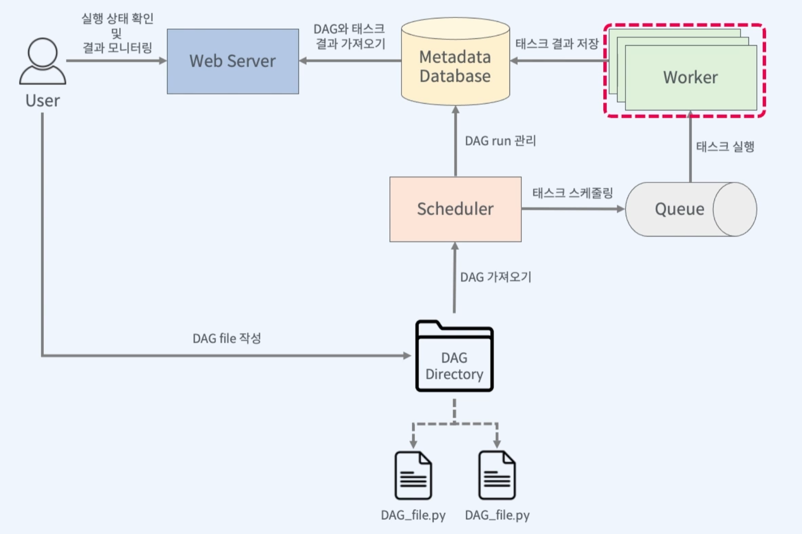

# AirFlow

## 개요

1. AirFlow의 소개
2. ㅁㄴ이ㅏㄴㅁㅇ
3. ㄴ마언밍


## 1. AirFlow의 소개

### Data pipeline



* 스크립트를 실행하여 순차적으로 실행
* 매일 오전 8시에 실행하기 
  * Cron
* 데이터 파이프라인이 N개가 있으면 


Script의 한계

* 태스크 간의 복잡한 의존관계
* 데이터 파이프라인의 실패 처리의 어려움


#### Workflow 관리 도구 기능

* 스케줄링
* 태스크 의존 관계 정의
* 실행 결과 알림 및 보관
* 실패 시 재실행


### AirFlow란?

프로그래밍 방식으로 워크 플로우를 작성하고 스케줄링 및 모니터링 하는 오픈 소스 플랫폼


### AirFlow의 특징

* Workflow를 파이썬으로 정의
* Workflow 스케줄링 및 실행
* 모니터링 및 실패 처리
* Backfill 기능 제공


### AirFlow의 핵심 개념

* DAG (Directed Acyclic Graph)

  

* Operator
  * BashOperator
  * PythonOperator
  * EmailOperator
  * Sensor (조건이 만족할 때 까지 기다렸다가 조건 만족시 Task 실행)
* Task (Airflow의 기본 실행 단위)
  * Task Instance


### Airflow Architecture



#### Executor

* Local Executor
  * Sequential Executor (한번에 하나의 Task 실행, )
  * Local Executor (여러 태스크를 병렬로 실행)
  * Debug Executor
* Remote Executor
  * Celery Executor (Python의 FrameWork사용)
  * Kubenetes Executor (쿠버네티스상에서 Workload 실행)
  * CeleryKubernetes Executor
  * Dask Executor
  * LocalKubenetes Executor


## 2. AirFlow설치 

```bash
$ pip install flast-wtf==0.15
$ pip install WTForms==2.3.3
$ pip install Jinja2=3.1.2
$ pip install apache-airflow
```


### Meta Data 초기화

```bash
$ airflow db init
# /home에 airflow 폴더 생김  
```


### 사용자 추가

```bash
$ airflow users create -h

$ airflow users create --username admin --password admin --firstname admin --lastname admin --role Admin --email admin@example.com
```


### 스케줄러 실행

```bash
$ airflow scheduler

# CPU 1-core 8GiB로는 scheduler와 webserver 동시에 실행하기 어려움
```


## 3. AirFlow 간단 예제

```python
from datetime import datetime
from airflow import DAG
from airflow.operators.bash import BashOperator

default_args = {
    'start_date': datetime(2022, 09,07)
}

with DAG(
    dag_id='simple_example',
    schedule_interval='5 6 * * *' # @daily
    catchup=False,
    default_args=default_args
) as dag:
    run_bash1 = BashOperator(
    	task_id='run_bash1',
        bash_command='echo hello fastcampus'
    )
```


