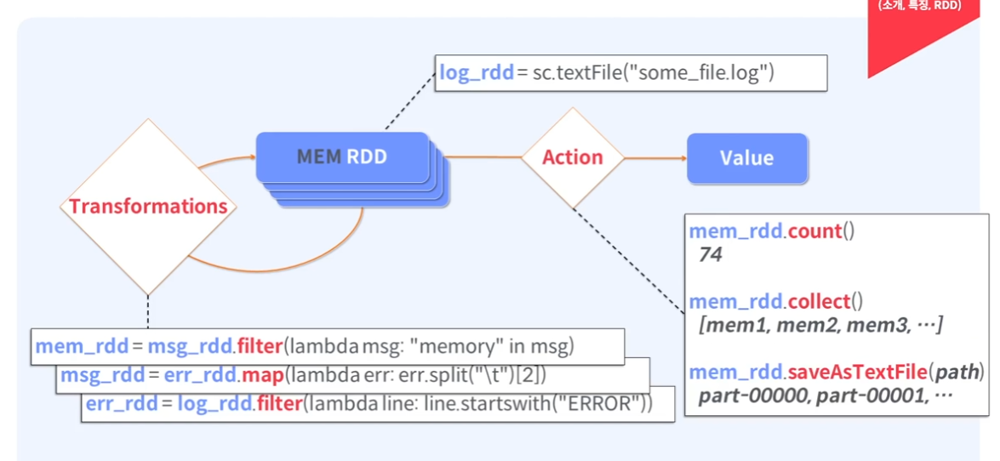

# Apache Spark

대용량 데이터에 의한 빅데이터 처리를 다수의 클러스터에서 분산 병렬 처리하기 위한 병렬 처리 엔진

## Apache (Spark 소개, 특징, RDD)

### Apache Spark

* Unified Engine: Support end-to-end applications
* High-level APIS: Easy to use, rich optimizations
* Integrate Broadly: Stroage systems, libraries, etc

### Apache Spark의 정의

* Apache Spark는 대용량 데이터 프로세싱을 위한 빠르고 범용적인 인메모리 기반 클러스터 컴퓨팅 엔진

* 분산 메모리 기반의 빠른 분산 병렬 처리

* 배치, 대화형 쿼리, 스트리밍, 머신러닝과 같은 다양한 작업 타입을 지원하는 범용 엔진으로 Apache Hadoop과 호환

* Scala, Java, Python, R기반 High-level APIs 제공

  

* 클러스터 내에서 분산 병렬 처리, CPU, Memory에 대한 관리를 직접 하는 것은 아님
* Cluster Manager는 따로 존재함 (YARN, Kubernetes)

* Spark Core
  * Scheduling, Fault Tolerance 등의 역할 담당
  * RDD 기반으로 병렬 분산 처리

### Apache Spark 특징

* In-Memory  컴퓨팅(Disk 기반도 가능)
* RDD (Resilient Distributed Dataset) 데이터 모델
* 다양한 개발 언어 지원(Scala, Java, Python, R, SQL)
* Rich APIs 제공 (80여개 이상, 2~10x Less Code)
* General execution graphs => DAG(Directed Acyclic Graph) => Multiple stages of map & reduce
* Hadoop과의 유연한 연계 (HDFS, HBase, YARN, and Others)

* 빠른 데이터 Processing(In-Memory Cached RDD, Up to 100x Faster)
* 대화형 질의를 위한 Interactive Shell (Scala, Python, R Interpreter)
* 실시간 Streaming Processing 
* 하나의 App에서 배치, SQL 쿼리, 스트리밍, 머신러닝고 ㅏ같은 다양한 작업을 하나의 워크플로우로 결합가능
* Both fast to write and fast to run

### RDD (Resilient Distributed Dataset) 

실패로부터 쉽게 회복 가능한 분산 데이터셋 구조를 추상화 한 것

논리적으로 데이터 객체들을 직접 변경 불가능 API를 통해 새 RDD를 생성하여 변경하여야 함

파티션으로 나누어져 작업 => 사용가능한 CPU 코어에 따라 동시에 병렬 처리 가능한 정도 결정

* Dataset
  * 메모리나 디스크에 분산 저장된 변경 불가능한 데이터 객체들의 모음
* Distributed
  * RDD에 있는 데이터는 클러스터에 자동 분배 및 병렬 연산 수행
* Resilient
  * 클러스터의 한 노드가 실패하더라도 다른 노드가 작업 처리
  * (RDD Lineage, AUtomatically rebuilt on failure)
* Immutable
  * RDD는 수정 불가능, 변형을 통한 새로운 RDD 생성
* Operation APIs
  * Transformation (데이터 변형) : RDD 내의 데이터를 변형하는 API
  * Actions (결과 연산 리턴/저장) : 드라이버 프로그램으로 데이터를 가져오거나 외부에 저장
* Lazy Evaluation: All Transformations
  * Transformation을 즉시 처리하지 않고 기록해두었다가 필요로 하는 Action API가 실행되면 한번에 처리
* Controller Persistence
  * Cache in RAM/Disk 기능(반복 연산에 유리)
  * 파티션 단위로 Cache

### RDD 생성 > RDD 변형 > RDD 연산

1. log를 받아와 내부 정보 저장
2. Transfomations를 반복하며 내가 원하는 형태로 만듬
3. 최종 RDD에 Action을 수행
4. 메모리가 너무 크다면 Out Of Memory 발생할 수 있다
5. saveAsTextFile로 드라이버에 저장 -> 분산 저장 됨

## Apache Spark (지원언어 Interactive Shell)

### Apache Spark 지원언어

#### Standalone Programs

* Scala, Java, Python, R

#### Interactive Shells

* Scala, Python, R

#### Performance

* Scala/Java are faster due to static typing
* ... but Python is often fine

### Interactive Shell

Interactive Analysis

* The Fastest Way to Learn Spark
* Available in Python, Scala, R
* Runs as an application on an existing Spark Cluster... or can run locally