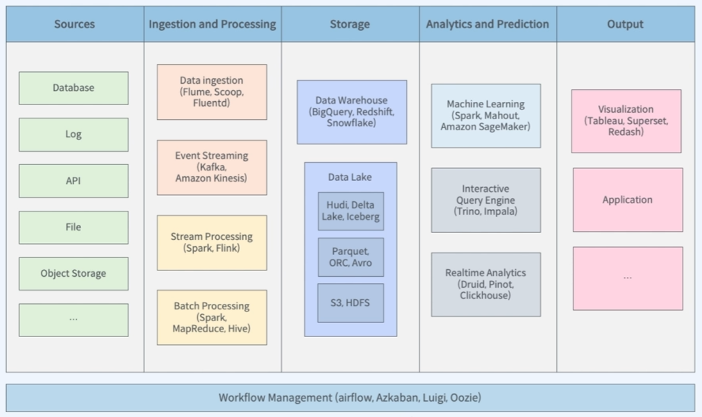

# Hadoop Ecosystem

## Overview

### Hadoop

* 분산 파일 시스템
  * HDFS(Dadoop Distributed File System)
* 리소스 관리자
  * YARN(Yet Another Resource Negotitation)
* 분산 데이터 처리 
  * MapReduce

* 데이터 수집
  * Apache Flume
  * Kafka
* 데이터 처리
  * MapReduce
  * Spark - 배치, 스트리밍, 그래프 처리, ML 제공
    * 현재 가장 많이 사용되고 있는 데이터 처리 시스템
    * 메모리에서 처리함으로써 속도가 빠름
    * SparkQL을 이용한 배치 처리 또한 가능
  * HIVE  - SQL을 통해 배치 처리를 할 수 있도록함, 구조화된 데이터를 HiveQL을 통해 처리
  * Impala - 대화형 쿼리 엔진
  * Flink
  * Kafka
* 데이터 저장
  * HDFS - 분산 Object Storage
    * 데이터를 데이터 소스로 하여 배치 처리 가능
    * NoSQL의 저장소로 사용 가능
    * Storage Layer를 두어 고도화된 
    * 데이터 웨어하우스로도 사용 가능하다.
  * HBASE - NoSQL
* 데이터 분석
  * 대화형 쿼리 엔진
    * Trino
    * Impala
  * 실시간 분석
    * Druid
    * Pinot
  * 머신러닝
    * Spark - MLlib 제공
    * Mahout
* Zoo keeper - 서버간의 상호 조정을 위한 서비스 제공
* Workflow 관리 도구
  * Apache Airflow
  * Oozie
* 보안
  * Apache Ranger - 권한 부여 및 엑세스 제어
* 메타데이터 관리
  * Apache Atlas - 테이블 컬럼을 해시태그를 이용해서 검색 가능, 특정 컬럼에 대한 마스킹 or 접근제한 제공
* Notebook
  * Apache Zetplin - 분석 결과를 테이블 및 그래프로 보여줌 
* Visualization
  * Apache Superset

## 빅데이터 플랫폼과 Hadoop

## Hadoop Cluster 구축 고려사항

### 클러스터란?

* 정의

  * 여러 대의 컴퓨터들이 연결되어 하나의 시스템처럼 동작하는 컴퓨터들의 집합
  * Master와 Worker로 구성
  * Master - Worker 노드들을 조율, Worker에서 실행되는 서비스나 데이터에 대한 메타데이터 관리
    * 2~3대로 구성
  * Worker - 실제로 작업을 수행하는 노드, 데이터 처리 or 조회 
    * 많음

  * Gateway - Master와 Worker에 접근할 수 있도록 하는 노드

    

### Master-Worker 구조

* 주 업무 하나와 부 업무를 두어 하나의 노드에 문제가 발생하더라도 다른 서버가 해결할 수 있도록 함
* 에러 발생을 대비해 Partition들의 복제본들을 다른 Worker에 저장해둔다.

### 클러스터의 규모 결정

클러스터의 규모보다 데이터의 수와 증가 속도에 대한 고려가 필요!

* **스토리지 용량으로 결정하기**

  * 저장될 데이터 크기 예측
  * 복제 전략 결정 - 일반적으로는 Replication Factor = 3으로 설정되어있음
  * 저장 기간 고려
  * 필요한 노드 수 결정
  * 추가 고려사항
    * 데이터 포맷
    * 데이터 압축 여부 
    * 데이터 증가율의 변화

  

* **데이터 수집 속도로 결정하기**

  * 데이터 수집 속도 예측

  * 데이터 처리 속도 예측

    

* **클러스터 하드 웨어 결정**
  * 워크로드에 따른 하드웨어 선정
    * CPU - 분석을 위해서는 연산 속도가 빨라야 하므로 중요
    * Memory - 분석을 위해서는 연산 속도가 빨라야 하므로 중요
    * I/O