# Kafka

## Kafka 기초

### Apache Kafka란?

Apache Kafka is an open-source **distributed event streaming platform** used by thousands of companies for high-performance data pipelines, streaming analytics, data integration, and mission-critical applications

* 분산 이벤트 스트리밍 플랫폼

  * 하나의 기능만 제공 X

  * 하나의 데이터 파이프라인을 구성할 수 있는 다양한 기능 제공

  * 데이터 이벤트를 실시간 수집, 처리, 저장

    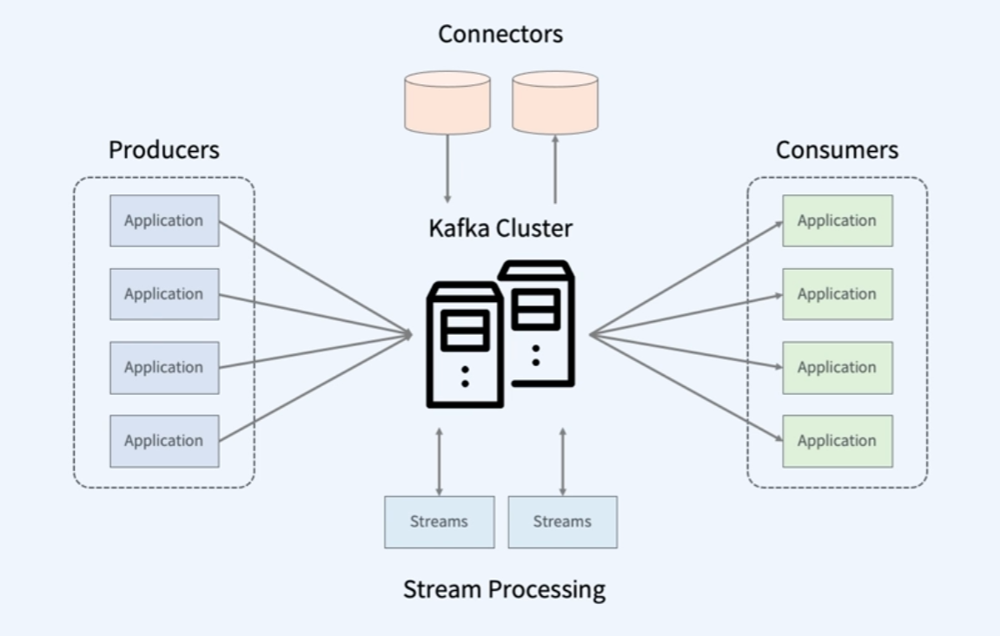

  * Connector: 편리하게 데이터를 수집하고 내보낼 수 있게 함


### Kafka 설계 원칙

* 이해하기 쉬운 API를 제공
* 스케일 아웃 아키텍쳐
  * 병렬적 확장 => 확장이 용이하다.
* 디스크로 데이터 영속화

* 메시지를 디스크에 순차적으로 저장 => 빠른 데이터 처리 가능

  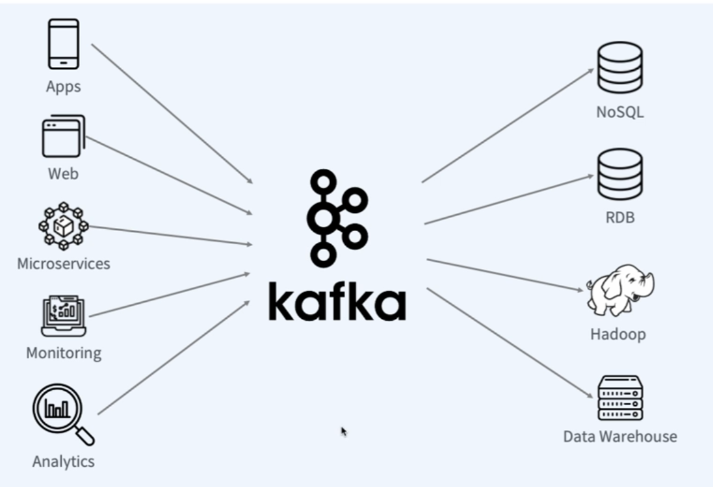


### Kafka Architecture

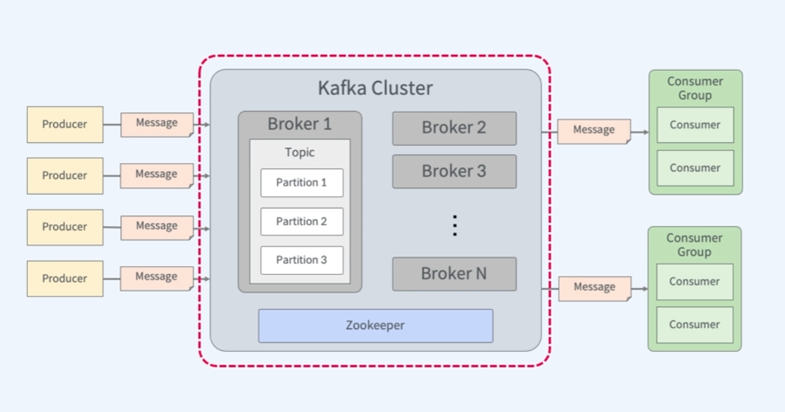

* 여러대의 Broker Server와 Zookeeper로 이루어짐

* Broker 추가를 통해서 Scale-out 가능

* 브로커 내의 메시지를 Topic 별로 관리

  * Producer와 Consumer는 특정 Topic을 통해 메시지를 주고 받게 됨
  * `Producer`: 데이터 생산자
    * 브로커에 메시지를 보내는 어플리케이션
    * 프로듀서 API를 사용 or 다양한 도구를 통해 메시지를 보냄
  * `Consumer` 
    * 브로커로부터 데이터를 가져와서 처리하는 어플리케이션
    * 컨슈머 API를 통해 데이터 가져옴 or Spark나 Flink 사용가능
    * `Consumer Group`: 토픽의 데이터를 사용하기위해 협력하여 처리하는 집합

* 토픽에 대한 대량의 메시지의 입출력을 처리하기 위해 파티션 단위로 분할하여 저장하고 읽게 됨

  * Partition은 분산 배치 되어있음

* 파티션의 번호를 통해 메시지의 위치를 나타내는 offset을 설정할 수 있음

* Zookeeper는 카프카의 브로커들을 하나의 클러스터로 관리하기 위한 역할 수행

  * 최근에는 Zookeeper를 사용하지 않고도 만들 수 있게 하려고 하는 중

    


## Kafka의 구성요소

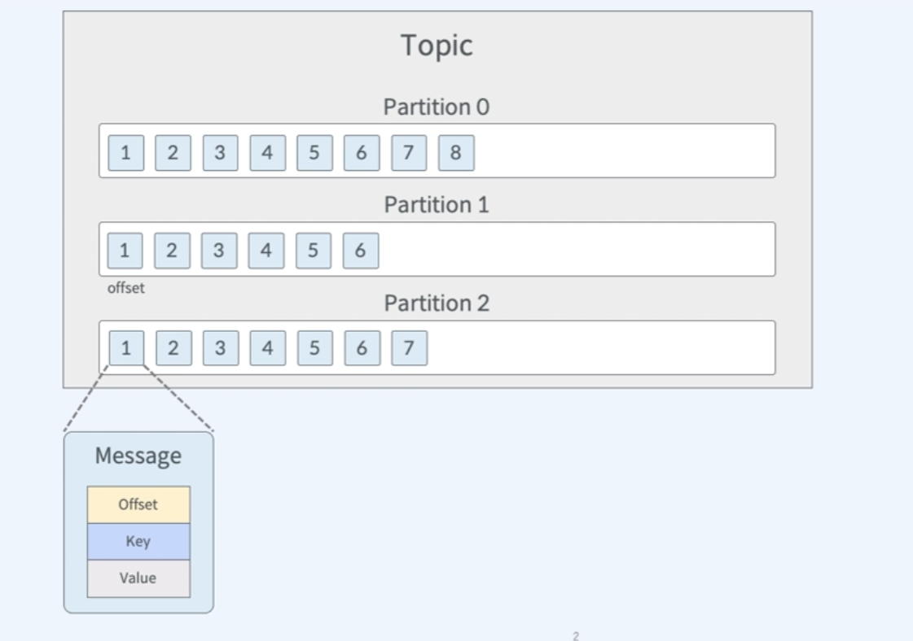

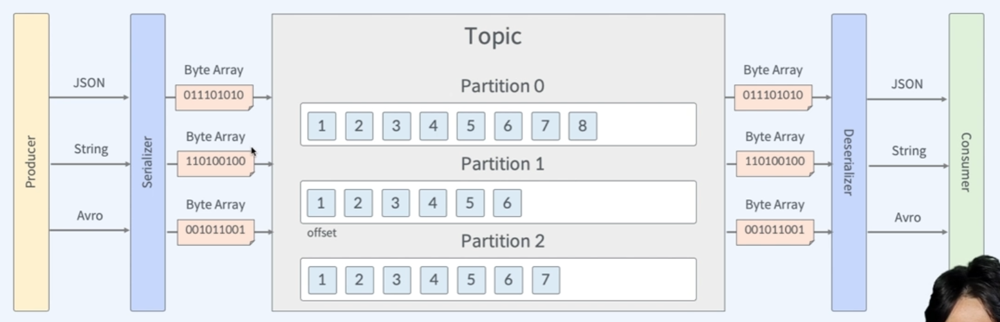

* **Topic** : 메시지를 구분하는 단위
  * 한 개이상의 파티션을 가지고 있음
* **Partition**
  * Producer가 보낸 메시지들이 저장됨
  * 각 파티션에서 offset이 부여됨 => 메시지의 위치를 알 수 있음, 재처리 가능
* **Broker**
  * 보내진 데이터들을 실질적으로 디스크에 저장
  * 데이터들을 정해진 시간이나 용량이 지나면 자동으로 삭제됨

* **Message**
  * 바이트 배열로 처리 (Serializer를 통해 Bite Array로 변환)


### Partitioning

들어온 메시지를 어느 Partition으로 보낼지 결정하는 것

* Hash partitioner

  * 보내는 메시지의 key값을 기준으로 partition이 정해짐

  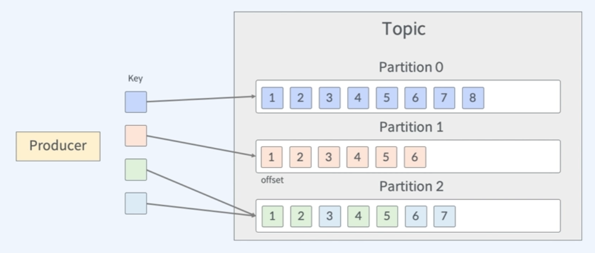

* Round-Robin partitioner

  * 보내는 메시지에 key값을 지정하지 않았을 때 그냥 돌아가면서 파티션 나눔

  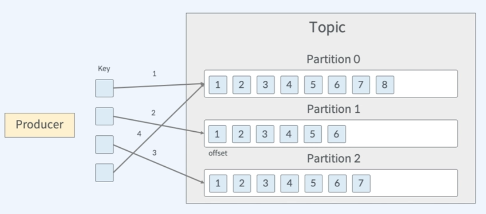


### Producer

* Producer API를 이용하여 Broker에 데이터를 전송하는 어플리케이션
* Message를 Kafka의 어떤 토픽에 어느 파티션에 보낼지 결정

* flow

  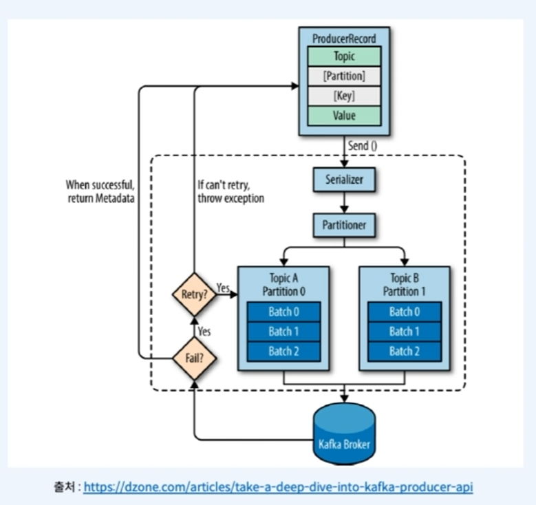


### Consumer

* Consumer API를 사용하여 브로커로부터 메시지를 가져와 처리하는 어플리케이션
* Consumer Group이 있어 하나의 어플리케이션의 여러 컨슈머들이 여러 파티션에서 메시지를 받을 수 있음
  * 이를 통해 분산 처리가 가능

* 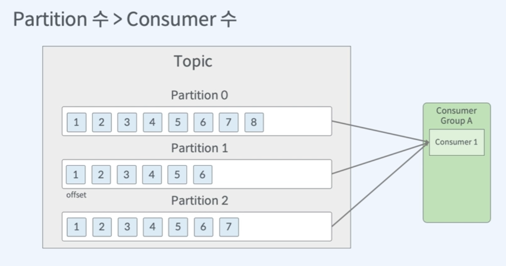

  * 이와 같은 경우 하나의 Consumer에서 모든 Partition의 데이터를 처리해야하기 때문에 처리량이 떨어짐

* 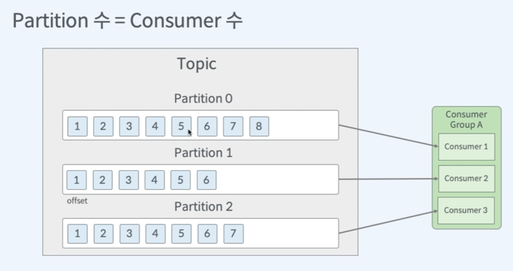

  * 가장 이상적인 상태

  * 가장 처리량이 빠르다.

* 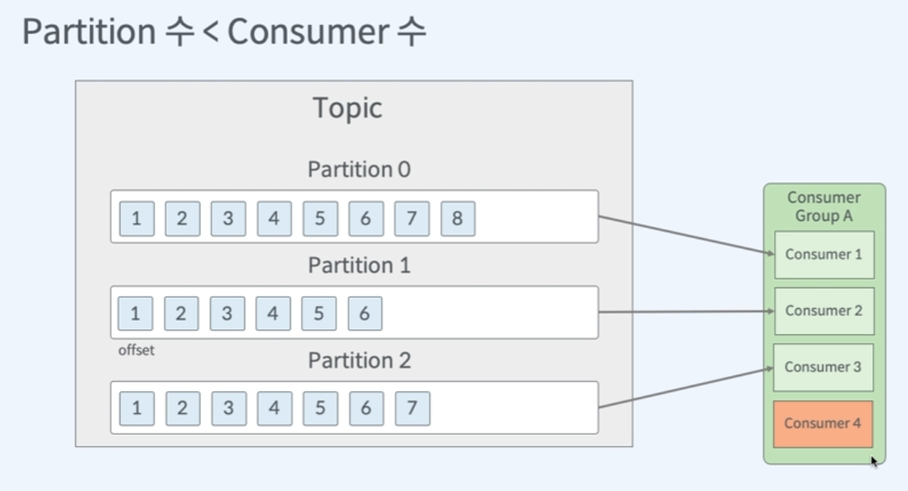

  * 컨슈머 하나가 놀고 있다.
  * 에러를 대비해 한개의 여분 Consumer를 만들 수도 있지만 장애가 일어날때 리밸런싱이 일어나기 때문에 굳이 여분을 만들 필요 없음

* 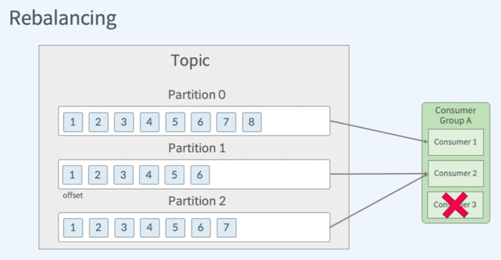

  * 하나의 Consumer가 더이상 데이터를 읽을 수 없을 때 하나의 파티션을 다른 Consumer에게 할당

* 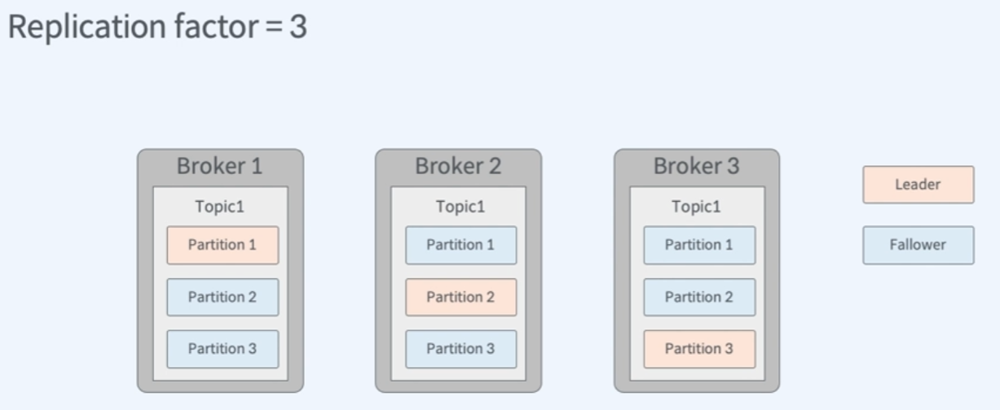

  * Partition단위 복제 
  * Topic을 생성할 때, Replication factor 또한 설정한다.


## 실습

### Kafka Cluster 구축

* Docker 설치
* docker-compose.yml 파일 생성
* Docker hub에 들어가서 이미지 확인할 수 있음

```yaml
<?xml version="1.0" encoding="UTF-8"?>

<project xmlns="http://maven.apache.org/POM/4.0.0" xmlns:xsi="http://www.w3.org/2001/XMLSchema-instance"
  xsi:schemaLocation="http://maven.apache.org/POM/4.0.0 http://maven.apache.org/xsd/maven-4.0.0.xsd">
  <modelVersion>4.0.0</modelVersion>

  <groupId>com.fastcampus.kafka</groupId>
  <artifactId>kafka-example</artifactId>
  <version>1.0.0</version>

  <properties>
    <project.build.sourceEncoding>UTF-8</project.build.sourceEncoding>
    <maven.compiler.source>1.8</maven.compiler.source>
    <maven.compiler.target>1.8</maven.compiler.target>
  </properties>

  <dependencies>
    <dependency>
      <groupId>org.apache.kafka</groupId>
      <artifactId>kafka-clients</artifactId>
      <version>3.1.0</version>
    </dependency>
  </dependencies>

  <build>
    <plugins>
      <plugin>
          <groupId>org.apache.maven.plugins</groupId>
          <artifactId>maven-shade-plugin</artifactId>
          <version>3.3.0</version>
          <configuration>
              <!-- put your configurations here -->                         
          </configuration>
          <executions>
              <execution>
                  <phase>package</phase>
                  <goals>
                      <goal>shade</goal>
                  </goals>
              </execution>
          </executions>
      </plugin>
    </plugins>
  </build>
    
```

```bash
$ docker-compose up # docker-compose 실행
$ docker-compose rm -fsv # 기존에 실행되고 있던 docker-compose 내의 컨테이너 삭제
```


### Kafka Producer 

* pom.xml

  ```xml
  <?xml version="1.0" encoding="UTF-8"?>
  
  <project xmlns="http://maven.apache.org/POM/4.0.0" xmlns:xsi="http://www.w3.org/2001/XMLSchema-instance"
    xsi:schemaLocation="http://maven.apache.org/POM/4.0.0 http://maven.apache.org/xsd/maven-4.0.0.xsd">
    <modelVersion>4.0.0</modelVersion>
  
    <groupId>com.fastcampus.kafka</groupId>
    <artifactId>kafka-example</artifactId>
    <version>1.0.0</version>
  
    <properties>
      <project.build.sourceEncoding>UTF-8</project.build.sourceEncoding>
      <maven.compiler.source>1.8</maven.compiler.source>
      <maven.compiler.target>1.8</maven.compiler.target>
    </properties>
  
    <dependencies>
      <dependency>
        <groupId>org.apache.kafka</groupId>
        <artifactId>kafka-clients</artifactId>
        <version>3.1.0</version>
      </dependency>
    </dependencies>
  
    <build>
      <plugins>
        <plugin>
            <groupId>org.apache.maven.plugins</groupId>
            <artifactId>maven-shade-plugin</artifactId>
            <version>3.3.0</version>
            <configuration>
                <!-- put your configurations here -->
            </configuration>
            <executions>
                <execution>
                    <phase>package</phase>
                    <goals>
                        <goal>shade</goal>
                    </goals>
                </execution>
            </executions>
        </plugin>
      </plugins>
    </build>
  
  </project>
  ```

* KafkaProducerExample.java

  ```java
  package com.fastcampus.kafka;
  
  import java.util.Properties;
  
  import org.apache.kafka.clients.producer.KafkaProducer;
  import org.apache.kafka.clients.producer.ProducerConfig;
  import org.apache.kafka.clients.producer.ProducerRecord;
  import org.apache.kafka.common.serialization.StringSerializer;
  
  public class KafkaProducerExample {
      public static void main(String[] args) {
          Properties props = new Properties();
          props.put(ProducerConfig.BOOTSTRAP_SERVERS_CONFIG, "localhost:9092");
          props.put(ProducerConfig.CLIENT_ID_CONFIG, "ProducerExample");
          props.put(ProducerConfig.KEY_SERIALIZER_CLASS_CONFIG, StringSerializer.class);
          props.put(ProducerConfig.VALUE_SERIALIZER_CLASS_CONFIG, StringSerializer.class);
  
          KafkaProducer<String, String> producer = new KafkaProducer<>(props);
          producer.send(new ProducerRecord<>("test-topic", "hello fastcampus"), (recordMeta, exception) -> {
              if (exception == null) {
                  System.out.println("Record written to offset " +
                  recordMeta.offset() + " timestamp " + recordMeta.timestamp());
              } else {
                  System.err.println("An error occurred");
                  exception.printStackTrace(System.err);
              }
          });
  
          producer.flush();
          producer.close();
      }
  
  }
  ```

* ```bash
  # in kafka-example
  $ java -cp .\target\kafka-example-1.0.0.jar com.fastcampus.kafka.KafkaProducerExample
  ```

  

### Kafka Consumer

* KafkaProducerExample.java

  ```java
  package com.fastcampus.kafka;
  
  import java.util.Properties;
  
  import org.apache.kafka.clients.producer.KafkaProducer;
  import org.apache.kafka.clients.producer.ProducerConfig;
  import org.apache.kafka.clients.producer.ProducerRecord;
  import org.apache.kafka.common.serialization.StringSerializer;
  
  public class KafkaProducerExample {
      public static void main(String[] args) {
          Properties props = new Properties();
          props.put(ProducerConfig.BOOTSTRAP_SERVERS_CONFIG, "localhost:9092");
          props.put(ProducerConfig.CLIENT_ID_CONFIG, "ProducerExample");
          props.put(ProducerConfig.KEY_SERIALIZER_CLASS_CONFIG, StringSerializer.class);
          props.put(ProducerConfig.VALUE_SERIALIZER_CLASS_CONFIG, StringSerializer.class);
  
          KafkaProducer<String, String> producer = new KafkaProducer<>(props);
          producer.send(new ProducerRecord<>("test-topic", "hello fastcampus"), (recordMeta, exception) -> {
              if (exception == null) {
                  System.out.println("Record written to offset " +
                  recordMeta.offset() + " timestamp " + recordMeta.timestamp());
              } else {
                  System.err.println("An error occurred");
                  exception.printStackTrace(System.err);
              }
          });
  
          producer.flush();
          producer.close();
      }
  
  }
  ```

  ```bash
  $ java -cp .\target\kafka-example-1.0.0.jar com.fastcampus.kafka.KafkaConsumerExample
  ```

  


## Kafka Connect

### Kafka Connect란?

* Kafka에 데이터를 넣거나 카프카에서 데이터를 추출하는 과정을 지원하는 도구

* Kafka와 다른 데이터 시스템과의 연계를 쉽게 해줌

  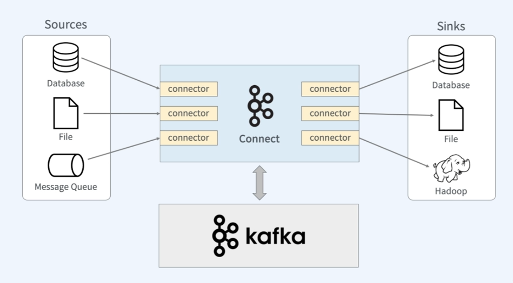

* 다른 시스템과 연결되는 부분을 Connector라는 플러그인을 구현하는 형태로 지원

  * Producer 쪽 Connector를 Source Connector
  * Consumer 쪽 Connector를 Sink Connector

  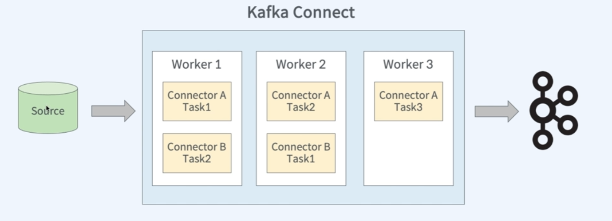


### Kafka Connect 구성요소

* Worker
  * Connector 와 Task들이 Worker 위에서 실행됨
  * Worker가 하나면 단독 모드, Worker가 여러개면 분산 모드
* Connector
  * 데이터를 가져오기 위한 작업들을 정의하고 Task를 관리
* Task
  * 커넥터에 정의된 작업을 직접 수행
* Converter
  * 데이터를 Kafka에 저장 or Read시에 변환하는 기능
* Transform
  * 커넥터에 의해 전송되는 메시지를 변경하는 경우 사용 (수정)


### Kafka Connect 실습
