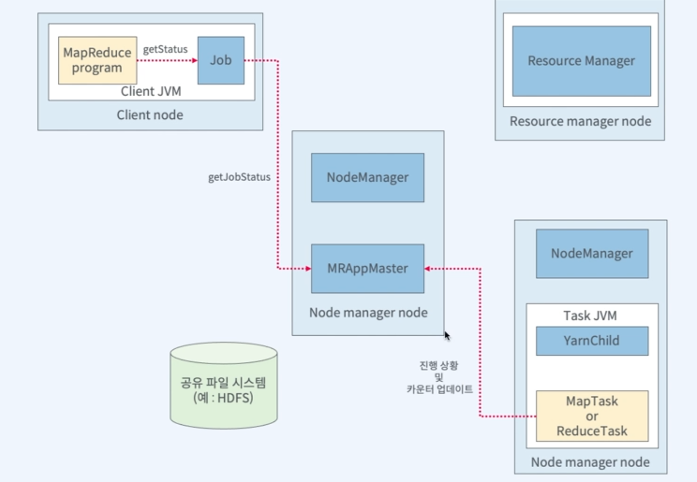

# MapReduce 

## MapReduce 처리과정

### InputFormat

* 입력 파일이 분할되는 방식(InputSplit)
* 읽는 방식(RecordReader)

#### InputFormat의 종류

* FileInputFormat
  * TextInputFormat
  * CombineFileInputFormat 
    * 크기가 작은 애들을 모아서 한번에 처리 
  * KeyValueTextInputFormat
    * 구분자를 전달
  * SequenceFileInputFormat
    * 하둡에서 구현된 binary 파일 포맷
    * Key-Value pair로 구성
    * Binary로 저장되어 있어서 속도가 빠름
    * 압축에 따른 포맷
      * Uncompressed SequenceFile Format
      * Record-compressed SequenceFile Format
      * Block-compressed SequenceFile Format
    * 용도
      * 작은 파일들을 모아 SequenceFile로 묶어서 사용
      * 압축을 통해 shuffling의 트래픽 양을 줄이는데 사용
* DBInputFormat
* ...

### InputSplit

* 맵의 입력으로 들어가는 데이터를 분할하는 방식 정의

### RecordReader

* 스플릿으로부터 실제로 데이터를 읽는 것
* 단순 반복자

### Mapper

* 비즈니스 로직이 처리되는 곳

### Combiner

* Shuffle을 통해 Reducer에 전달되는 과정에서 네트워크 트래픽을 최소화하기 위해 Map의 결과를 추가적으로 처리해서 트래픽을 줄이는 역할
* 꼭 필수적인 처리과정은 아니다

### Partitioner

* 맵의 결과를 어느 Reducer에 보낼지 Key를 기준으로 결정

## MapReduce Job 실행 분석

## MapReduce 진행 상황과 상태 업데이트

### MapReduceJob 완료

* 마지막 태스크가 완료되면 AM이 Job상태를 성공으로 변경
* 클라이언트에서 실행한 waitforCompletion메서드가 반환
* Job통계와 카운터와 같은 메시지를 출력
* 히스토리 서버에 잡 정보 기록