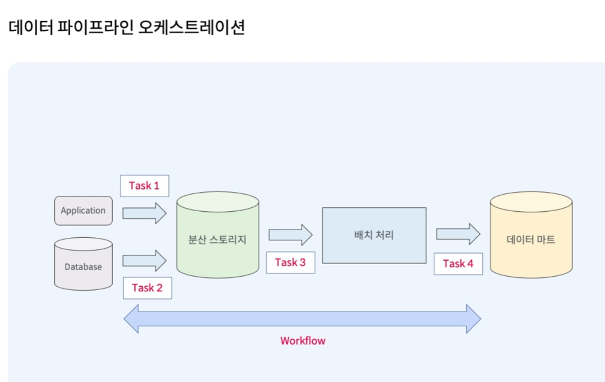
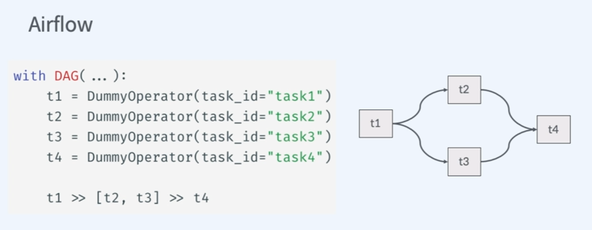
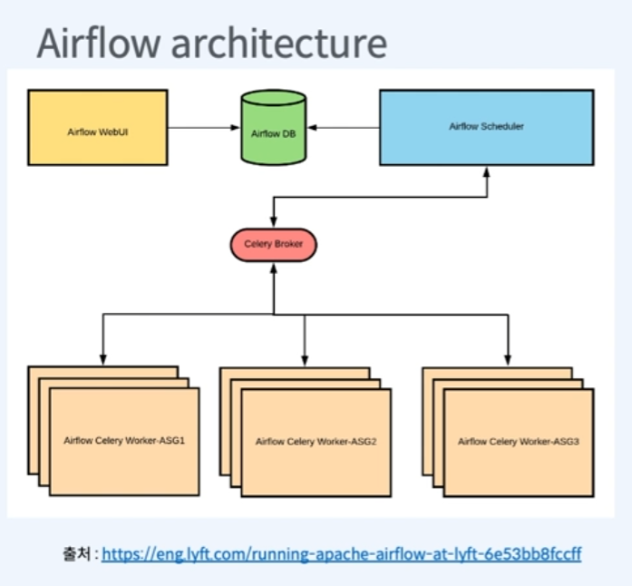
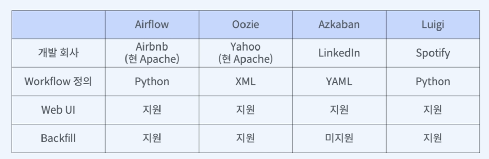

# 데이터 파이프라인

`파이프라인`: 하나의 데이터 처리 단계의 출력이 다음 단계의 입력으로 이어지는 형태로 연결된 구조

`데이터 파이프라인` : 다양한 소스에서 데이터를 변환하고 옮기는 일련의 과정을 구성한 시스템

* Source > Processing > Destination

* ex) Logfile > Amazon S3 > Process > Amazon Redshift

### Why?

* 데이터 기반 의사결정
  * 비즈니스 데이터 분석
  * 리포팅
* 데이터 기반 애플리케이션
  * 머신러닝
  * 데이터 사이언스

### Who?

 **데이터 엔지니어가 데이터 파이프라인을 구축하고 운영한다**

+ 데이터 분석가 및 과학자의 요구사항 반영

## 데이터 파이프라인 패턴

`데이터 웨어하우스` : 기업의 모든 데이터의 이력을 한군데로 모음

* 대량의 데이터를 처리하고 오랫동안 보관하는 것에 최적화
* 소량의 데이터를 자주 읽고 쓰는데 적합하지 않음

* RDB는 정규화된 스키마 사용
* Data Warehouse의 경우 분석에 적합하게 스타 스키마 사용
  * fact table을 가운데 두고 주변에 차원테이블을 둔다
    * 각 차원과 관련된 모든 활동을 저장(ex. 숫자 데이터 등)
    * `차원테이블` : 데이터를 분류하기 위한 속성들이 저장

#### ETL

* Extract
  * RDBMS, NoSQL DBMS, SAAS, XML 등에서 데이터를 추출
* Trasnform
  * Data Warehouse에 저장할 수 있는 형태로 변환
* Load
  * Data Warehouse에 적재

#### ELT

* 데이터를 추출해 일단 저장하고 사용시에 어떻게 변환할지 결정 후 변환 작업을 수행
* Data가 커지고 다양해지면서 ETL 작업이 너무 복잡해짐
* Data Lake 사용

##### DataLake

* 주로 분산 Object 스토리지에 저장
* 계층별로 나누어 저장
  * 1단계: 원본데이터
  * 2단계: 분석용 데이터
  * 3단계 피처 데이터(ML, AI) / 집계 데이터

#### Data Lake vs Data Warehouse

**Data Lake**

* 주로 Raw 데이터를 저장

**Data Warehosue**

* 스키마에 맞게 변환하여 데이터를 저장

## 데이터 파이프라인 오케스트레이션

### 오케스트레이션

* 정의
  * 여러개의 컴퓨터 시스템, 어플리케이션 또는 서비스를 조율하고 관리하는 것
  * 복잡한 태스크와 워크플로를 쉽게 관리할 수 있도록 도와줌

* 보통 Workflow를 실행하기 위해서 각각의 Task의 실행들을 Script로 작성해서 실행

* 스크립트의 한계

  * Workflow가 복잡
  * 태스크의 의존 관계가 복잡
  * 실패 시 처리 어려움

* **Workflow 관리 도구 기능**

  * 스케줄링

  * 태스크 의존 관계 정의

    * **`DAG(Directed Acyclic Graph)`**

      * 방향성 (Directed)

        * 간선에 방향이 존재

      * 비순환 (Acyclic)

        * 그래프의 한 정점에서 시작하여 다시 시작 정점으로 이어지는 간선이 존재하지 않음
        * 사이클이 존재하지 않음

      * ex) 게임 스킬트리

        

      * Python으로 정의

  * 실행 결과 알림 및 보관

  * 실패 시 재실행

* Workflow 엔진의 경우 Workflow 상태를 보관하기 위해 DB를 가진다.

  

* **복구** 

  * 코드상 문제 
  * 리소스 문제
  * 실패시 복구 방법
    * 재시도 (2~3회)
      * 횟수가 너무 많으면 실패 상황을 늦게 발견
      * 횟수가 너무 적으면 일시적인 문제가 해결되기 전에 잘릴 수 있음
    * backfill
      * 일정 기간 동안의 workflow를 재실행하는 것
      * 한번에 많은 데이터를 처리해야하기 때문에 주의해야함!

* Opensource Workflow Management Tools

  

  * Oozie의 경우 하둡 에코시스템과 호환이 잘 된다.