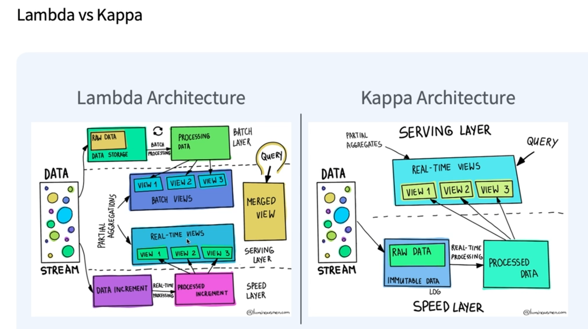

# 빅데이터 분석

### 플랫폼이란??

**`하드웨어 플랫폼`** : 동일한 제품을 일정한 품질로 만드는 프로세스와 그 제품을 만드는 장치

**`소프트웨어 플랫폼`** : 소프트웨어를 실행할 수 있는 기반이나 환경

* ex) Java Platform 
* 

`서비스 플랫폼` : 서비스 제공자의 서비스를 다른 서비스들이 쉽게 사용할 수 있게 해주는 환경

`빅데이터 플랫폼` : 기업 내의 많은 사용자들이 데이터를 처리하고 분석을 쉽게 할 수 있는 환경을 제공해주는 시스템

* 빅데이터 플랫폼 요구사항
  * 데이터 수집, 처리 및 저장
  * 데이터 발견, 검색, 보안 제공
  * 데이터 분석 및 ML 지원

* 빅데이터 아키텍처

  * Source - 데이터 생성

  * Ingestion and Transformation - 데이터 수집 및 처리  (ETL)

  * Storage - 데이터 저장 

  * Analytics - 데이터 분석

  * Output - 결과

    

* `데이터 파이프라인` : 데이터의 흐름을 구성하는 것

### Data Source

* 데이터가 생성되는 곳

**데이터의 종류**

* 정형(Structured) 데이터
  * RDBMS, 스프레드 시트
* 비정형(Unstructured) 데이터
  * 텍스트, 이미지, 음성, 영상
* 반정형(Semi-structured) 데이터
  * Json, XML, 웹 로그, 센서 데이터

**Data Source의 종류**

* Database
  * OLTP (Online Transaction Processing) 
    * 트랜잭션이 많음
    * 빠른 처리
    * 정규화된 데이터
    * 테이블이 많음
    * 현재 데이터
  * OLAP (Online)
    * 데이터가 많음
    * 느린 쿼리 (복잡한 분석을 위함)
    * 비정규화 데이터
    * 테이블이 적음
    * 이력 데이터

* 이벤트 컬렉터
* 로그
  * 서버의 로그
* API
* 파일
* Object Storage
* 기타

### Data Ingestion and Processing

* `배치형 데이터 수집`

  * 이미 어딘가에 존재하는 데이터를 수집하는 방식
    * 주기적으로 수집
    * 워크플로우 관리 도구의 도움
  * 데이터베이스
  * 파일
  * => 원하는 결과를 얻기까지 시간이 걸림

* `스트리밍형 데이터 수집`

  * 지속적으로 들어오는 데이터를 수집

    * 실시간 데이터 수집
    * NoSQL을 사용 or MessageQueue 사용

  * 애플리케이션 이벤트

  * 로그

  * 센서 데이터

    

#### **데이터 수집 도구**

* Apache Flume
  * 로그데이터를 효율적으로 수집, 저장
* Apache Scoop
  * 관계형 데이터베이스를 hdfs로 효율적으로 가져오기 위함
* Apache Kafka
  * Message Broker 프로젝트로 최근 많이 사용
* Apache Nifi
  * 기술 전송 프로그램의 일부
  * SW 시스템간의 데이터 흐름 자동화
* Fluentd
  * 로그데이터를 효율적으로 수집, 저장

#### **배치 처리 도구**

* MapReduce

* Spark

* Hive

  

#### **스트림 처리 도구**

* Flink

* Spark

* Kafka

  

**스트림 처리의 단점**

​	=> 잘못된 결과의 수정이 어려움

​	=> 지연된 데이터에 대한 처리의 문제

#### Lamba vs Kapa

**Lambda Architecture** 

* 동일한 계산을 수행하는 배치 시스템과 스트리밍 시스템을 둘 다 운영
* 배치 레이어, 서빙 레이어, 스피드 레이어

* 최근 24시간 이내의 데이터는 Real-Time Views 확인, 그 이전의 데이터는 Batch Views 확인

* **단점**	
  * 똑같은 계산을 수행하기 때문에 비효율적

**Kappa Archtecture**

* 스트리밍 시스템에서도 강력한 일관성 제공
* Lambda Architecture에서 배치 시스템 제거
* Message Broker가 다양한 기능 제공
  * 데이터 저장을 충분히 길게하면서 문제 발생시 롤백
* **단점**
  * 대량의 과거 데이터를 처리하는 경우 부하가 발생
  * 클라우드 기술의 발달로 일시적인 scale-out을 통해 처리 가능
    * `scale-out`: 장비를 추가해서 확장하는 방식

### Data Storage

* `Data Warehouse`
  * 서로 다른 시스템에 데이터가 모델링이 되어있는 데이터베이스
  * 정형화된 데이터베이스 (Lifting or Analyse에 최적화)
  * 10 페타바이트 이상의 데이터 크기 지원
  * Google BigQuery
    * 데이터 복제해서 저장 -> 안정성 높음
    * 배치, 스트리밍 지원
  * amazon redshift
    * Postgre SQL방식으로 열기반 압축 클러스터에 분산 저장
    * 컬럼 기반으로 저장
    * MPP(Massive Parrerel Processing) 데이터 병렬처리 
  * snowflake
    * Soft as a Service
    * 정형, 비정형 모두 지원
* `Data Lake` 
  * Raw 데이터 저장 => 다양한 데이터 저장
  * Parquet이나 ORC를 이용하여 저장
  * S3, HDFS 에 저장 
  * 또다른 storage layer를 이용하여 부가 기능 제공
  * Streaming 데이터 지원

### Analytics and Prediction

* 대화형 쿼리엔진을 통해 제공
* 실시간 분석 제공
* **Interactive Query Engine**
  * trino (중간 결과를 disk에 저장하지 않고 메모리에 저장하여 속도가 빠름)
  * presto
  * impala 
* **Realtime Analytics**
  * druid
  * pinot
  * 3clickhouse

* **Machine Learning**
  * Apache Spark
  * Azure Machine Learning
  * Amazon SageMaker

### Output

* Visualization (
* Apllication
* 목적
  * 데이터 기반 의사 결정
    * 비즈니스 의사 결정 도와주기
  * 데이터 기반 어플리케이션
    * 데이터의 도움을 받아 프로덕트를 향상시킴

* 예시
  * Tableau
    * 시각화 & 대시보드화, 시각화 기반 분석 가능
  * Superset
    * 오픈소스, 시각화 & 대시보드화, 보안 부족
  * Redash
    * 스케줄링 지원

### Workflow Management

* 정기적으로 Task를 실행하고 비정상 상태를 감지하여 정상화 

* Apache Airflow

  * python

* Luigi

  * python

* oozie

* 아즈카반

  